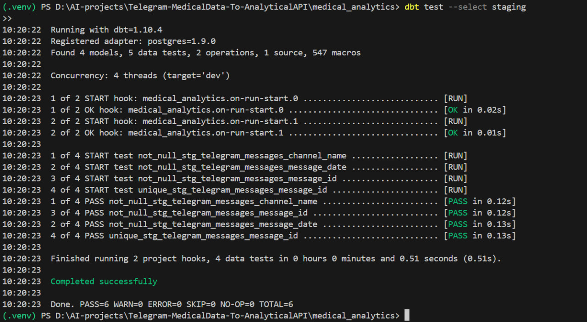

# Telegram-MedicalData-To-AnalyticalAPI

An end-to-end data pipeline for Telegram, leveraging dbt for transformation, Dagster for orchestration, and YOLOv8 for data enrichment.

# Task 0: Project Setup & Environment Management

## 📦 Prerequisites

- Python 3.8+
- PostgreSQL 13+
- pgAdmin 4
- Git

## 🛠️ Setup Instructions

## Clone the repository

- git clone https://github.com/yourusername/Telegram-MedicalData-To-AnalyticalAPI.git
- cd Telegram-MedicalData-To-AnalyticalAPI

## Create and activate virtual environment

- python -m venv .venv
- source .venv/bin/activate # Linux/Mac
- .\.venv\Scripts\activate # Windows

## Install Python dependencies

- pip install -r requirements.txt

# Set up PostgreSQL

# Configure environment variables (.env file)

# Task 1: Data Scraping and Collection (Extract & Load)

### 📋 Data Sources

Telegram channels:

- @CheMed123
- @lobelia4cosmetics
- @tikvahpharma

## 📂 Project Structure

data/
├── raw/ # Raw JSON files
│ └── telegram_messages/
│ ├── 2022-09-05/
│ │ └── CheMed123.json
│ └── 2025-05-20/
│ └── lobelia4cosmetics.json
└── processed/ # Cleaned data
src/
├── scraping/
│ ├── telegram_scraper.py
│ └── data_loader.py
└── load_to_postgres.py

## 🔧 Key Components

- Telegram Scraper (telegram_scraper.py)

## 🚀 Execution Flow

## Run the scraper (saves to JSON)

- python src/scraping/telegram_scraper.py

## 📊 Sample Output

Loaded 76 messages from data/raw/telegram_messages/2022-09-05/CheMed123.json
Loaded 1000 messages from data/raw/telegram_messages/2025-05-20/lobelia4cosmetics.json

# Task 2: Data Modeling and Transformation (Transform)

# Medical Analytics Data Transformation (dbt Project)

## 📌 Project Overview

This dbt project transforms raw Telegram medical channel messages from JSON files into an analytics-ready star schema in PostgreSQL. It serves as the "data transformation" layer between raw data and analytics/BI tools.

## 🛠️ Technical Stack

- **Database**: PostgreSQL
- **Transformation**: dbt (data build tool)
- **Data Sources**: JSON files scraped from Telegram channels
- **Schemas**:
  - `raw`: Original ingested data
  - `staging`: Cleaned source data
  - `analytics`: Dimensional model

## 📂 Project Structure

medical_analytics/
├── dbt_project.yml # Project configuration
├── models/
│ ├── staging/ # Staging models
│ │ ├── stg_telegram_messages.sql
│ │ └── schema.yml # Tests & docs
│ └── marts/
│ ├── core/ # Dimensional models
│ │ ├── dim_channels.sql
│ │ ├── dim_dates.sql
│ │ ├── fct_messages.sql
│ └── schema.yml
├── tests/
│ └── custom_data_tests/ # Custom data quality tests
├── macros/ # Reusable SQL code
└── packages.yml # dbt dependencies

## 🔄 Data Flow

1. **Raw Data**: JSON files → `raw.telegram_messages`
2. **Staging**:
   - Cleans raw data
   - Standardizes fields
   - Light transformations
   - Output: `staging.stg_telegram_messages`
3. **Marts**:
   - `dim_channels`: Channel metadata
   - `dim_dates`: Time dimensions
   - `fct_messages`: Message facts with foreign keys

## 🧪 Data Quality Tests

## Custom Tests

🚀 How to Run
Install dependencies:

- dbt deps
  Run transformations:
- dbt run
  Run tests:
- dbt test
  Generate docs:
- dbt docs generate
- dbt docs serve

## 🛠️ Common Operations

Command Description

- dbt run --select staging(Run only staging models)
- dbt test --select stg_telegram_messages (Test only staging)
- dbt run --exclude dim_dates (Run all except dim_dates)

## Data Flow Diagram



## 🧪 Data Quality Tests

### Automated Tests

```yaml
# Example from schema.yml
columns:
  - name: message_id
    tests:
      - unique
      - not_null
  - name: message_date
    tests:
      - not_null
```
